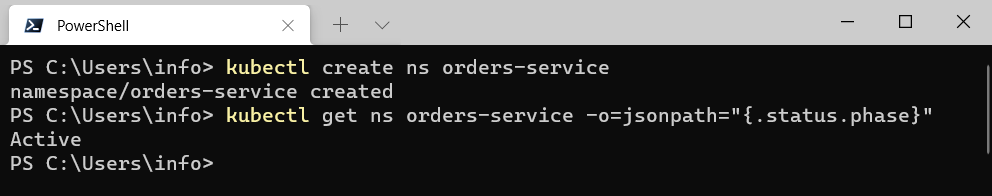
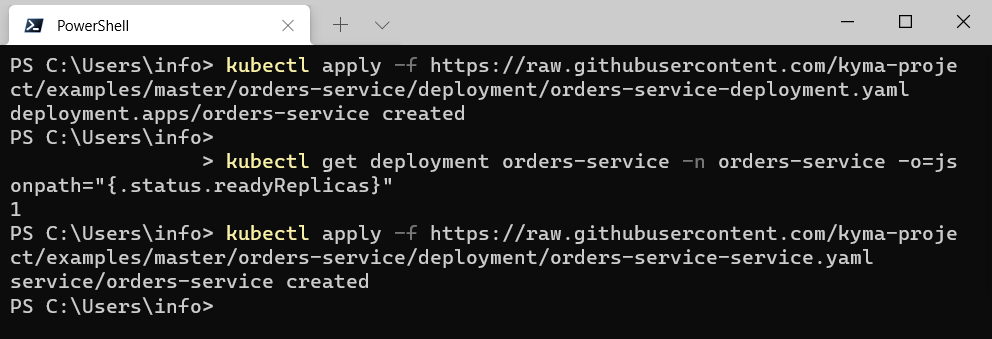
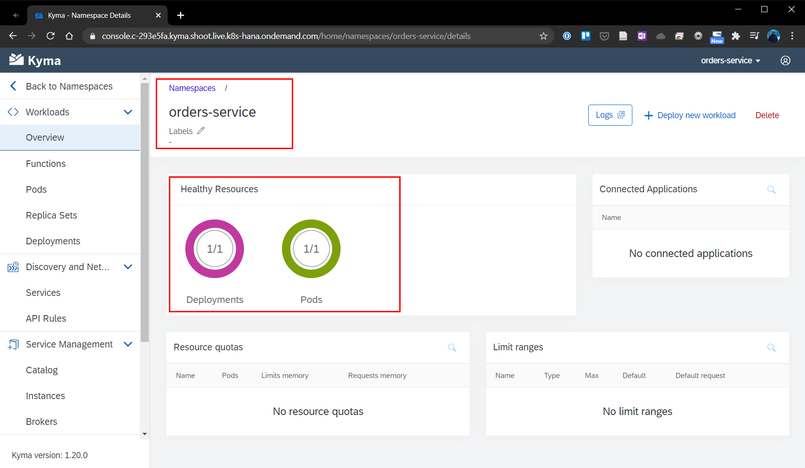
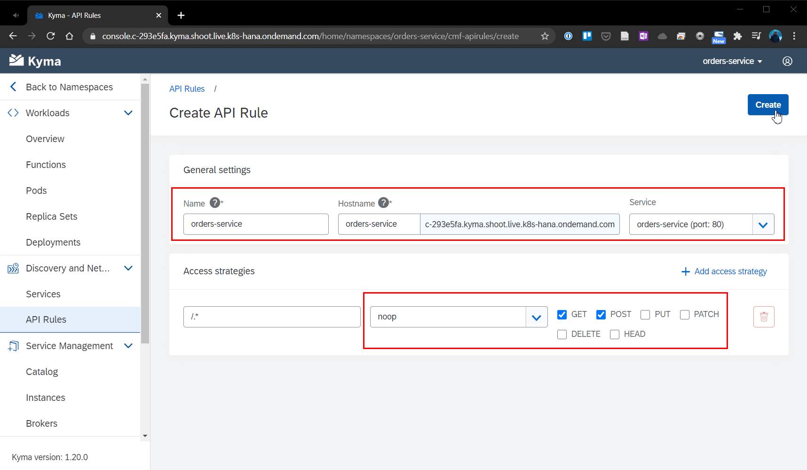
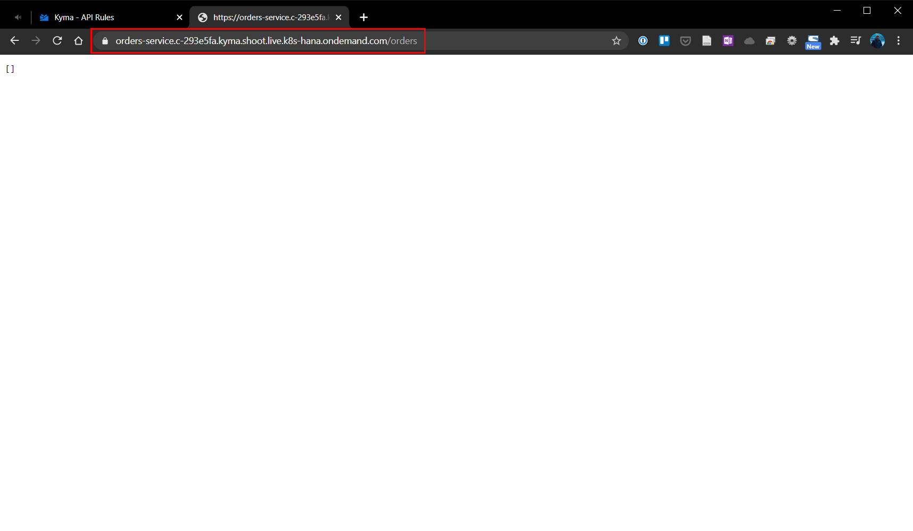
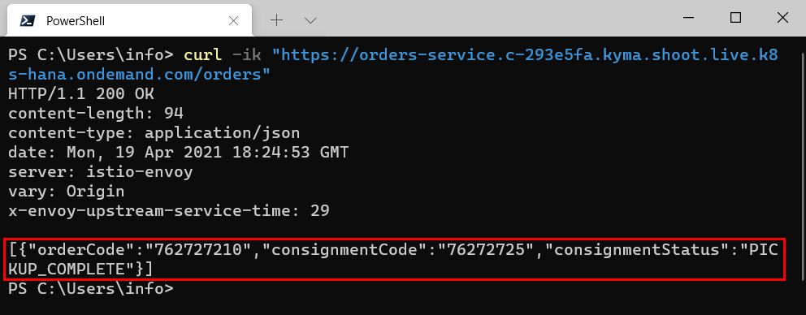

# Chapter 4.3.2: Implementation of the Microservice

Within this chapter the following steps will be performed and are described below:

* Create new "orders-service" namespace and deploy the Microservices "orders-service"
* Expose the microservice to other ressources outsite of the cluster
* Optional: Enhancement with MS Azure SQL database (as additional prototype cycle)

These steps are documented further below.


## Create new "orders-service" namespace and deploy the Microservices "orders-service" 

Firstly a new namespace for the new Microservice has to be created in Kyma.

1. Create a new namespace with the name "orders-service" with the following command and the command line.

```
kubectl create ns orders-service
```

2. Check that the Namespace was set up. This is indicated by performing the following command. The response will reflect the status of the Namespace with `Active`.

```
kubectl get ns orders-service -o=jsonpath="{.status.phase}"
```



3. Create a Deployment that provides the microservice definition and enables you to run it on the cluster. The Deployment uses the `eu.gcr.io/kyma-project/pr/orders-service:PR-162` image. This Docker image exposes the `8080` port on which the related Service is listening.

```
kubectl apply -f https://raw.githubusercontent.com/kyma-project/examples/master/orders-service/deployment/orders-service-deployment.yaml
```

4. Check if the ressources definied in the deployment file have been created. Deployment status will be readyReplicas `1`.

```
kubectl get deployment orders-service -n orders-service -o=jsonpath="{.status.readyReplicas}"
```

5. Deploy the Kubernetes Service in the "orders-service" Namespace to allow other Kubernetes resources to communicate with your microservice.

```
kubectl apply -f https://raw.githubusercontent.com/kyma-project/examples/master/orders-service/deployment/orders-service-service.yaml
```



6. The successful deployment and running pods is also reflected Kyma Runtime Environment User Interface, as shown below.




## Expose the microservice to other ressources outsite of the cluster

Until now a standalone and in a closed-environment microservice was deployed, now we have to allow to make is available to other ressources outsite of the cluster via an API Rule, this time via the Kyma Runtime Environment UI.

1. Select the namespace "orders-service" and go to "Discovery and Network" -> "API Rules" and create a new API Rule. 

2. Enter a specific name and hostname for the API rule. In this case "orders-service" can used as well. As Service "orders-service (port: 80)" shoud be selected, to indicate the Service name for which you want to create the API Rule.

3. As access stratgy select as handler "noop" and allow only "GET" and "POST" methods. This allows to send the orders to the Service and retrieve orders from it without any token. The configuration is shown below. Click on "create", to create and save the rules, as shown below.



4. The API rule status will be "OK" and you can access the Service by by selecting the HTTPS link under Host and adding the `/orders` endpoint at the end of it. For this case: `https://orders-service.c-293e5fa.kyma.shoot.live.k8s-hana.ondemand.com/orders`



5. To quickly test the availability of the microservice from external perform a POST request to the Microservice using the URL `https://orders-service.c-293e5fa.kyma.shoot.live.k8s-hana.ondemand.com/orders` and a sample orders similar as seen below.

```
{
    "orderCode": "762727210",
    "consignmentCode": "76272725",
    "consignmentStatus": "PICKUP_COMPLETE"
}
```

6. By further performing the following command, you will get back the processed order data as seen below. 

```
curl -ik https://orders-service.c-293e5fa.kyma.shoot.live.k8s-hana.ondemand.com/orders
```




------------------------------------

## Optional: Enhancement with MS Azure SQL database (as additional prototype cycle)

By now the microservice uses in-memory storage, which means every time you delete the Pod of the microservice or change the Deployment definition, you lose the order details.

 As after the termination of one pods, the in the in-memory database saved entries would be deleted. To avoid this, in the first step it was planned to use a [redis database](https://kyma-project.io/docs/root/getting-started#getting-started-add-the-redis-service) by adding the Redis service, create a service instance and bind it to the microservice. As some of the configuration was not available and after checking with the [SAP Community](https://answers.sap.com/answers/13349083/view.html), currently in the Kyma Runtime on SAP BTP, there is no full cluster access available, so adding customs services is not possible. 

Further an [alternative was decribed](https://answers.sap.com/answers/13350157/view.html) which can replace the redis approach and will be followed further.


In the managed runtime, you don't have full cluster access and e.g. add-ons which require Custom Resource Definitions are not yet possible.

Hi Florian,

You can find an in cluster example for redis in the mission

https://developers.sap.com/mission.cp-kyma-build-app.html

The mission

https://developers.sap.com/mission.cp-kyma-full-stack.html

details using mssql in cluster, but within the git repo that is referenced you will find an example using sql from microsoft azure that is a direct replacement.

https://github.com/SAP-samples/kyma-runtime-extension-samples/tree/master/database-azure-mssql

Regards,

Jamie

------------------------------------

## Sources

* Guide: [Kyma-Project: Getting Started, Version 1.21 (latest)](https://kyma-project.io/docs/root/getting-started/#getting-started-create-a-namespace) 
* Repository: [kyma-project/examples/orders-service](https://github.com/kyma-project/examples/tree/main/orders-service) and cloned into this Repository under [ba-kyma-prototype/4.3.2_implementation/orders-service](https://github.com/klouisbrother/ba-kyma-prototype/tree/main/4.3.2_implementation/orders-service)
* Repository: [SAP-samples/kyma-runtime-extension-samples/database-azure-mssql](https://github.com/SAP-samples/kyma-runtime-extension-samples/tree/master/database-azure-mssql)
* Helpful input: [SAP Blogs: SAP Cloud Platform, Kyma runtime: Mock Applications](https://blogs.sap.com/2020/06/17/sap-cloud-platform-extension-factory-kyma-runtime-mock-applications)
* Further Helpful input from the SAP Community: [SAP Community: Add external Service to Kyma not possible in Trial](https://answers.sap.com/questions/13348971/add-external-service-to-kyma-not-possible-in-trial.html?childToView=13350157#answer-13350157)
 

## Summary and next step

With this chapter the Microservice was implemented, is available and running. Further it was made available to the outsite. Also the optional step of implementing a MS Azure database was performed. As next step the connection between the Microservice and SAP Commerce has to be done.

[Next - Chapter 4.3.3: Connection of Microservice and SAP Commerce](https://github.com/klouisbrother/ba-kyma-prototype/tree/main/4.3.3_connection) 