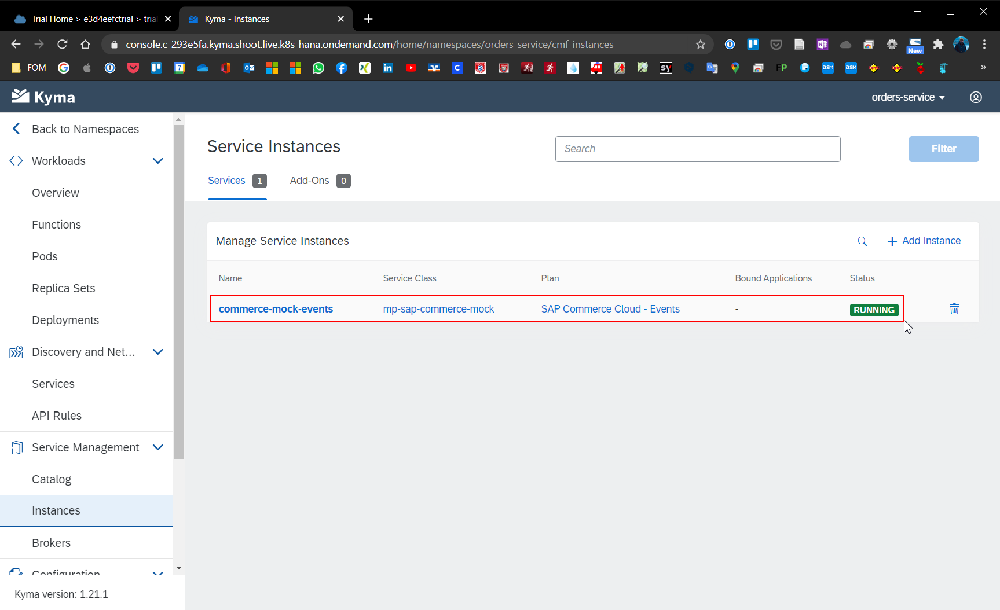
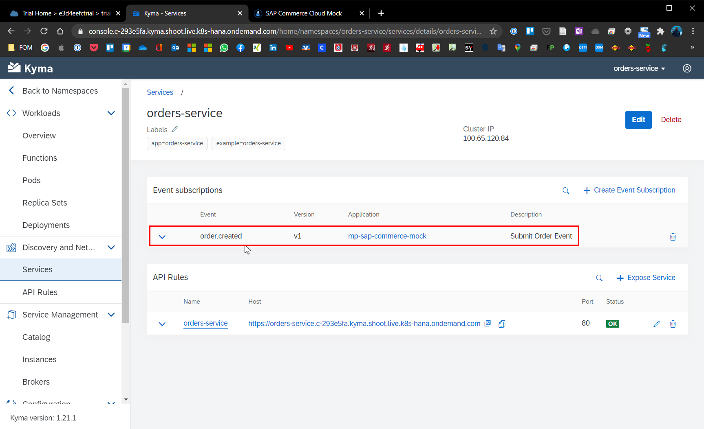

# Chapter 4.3.3: Connection of Microservice and SAP Commerce

Within this chapter the following steps will be performed and are described below:

* Connect Commerce-Mock as external application
* Create the event trigger

## Connect Commerce-Mock as external application 

After provisioning the Microservice and the SAP Commerce Mock, let's  connect the systems. For this part the configuration will be shown in the Kyma Runtime Environment UI.

1. In the Kyma Runtime Environment UI access "Integration" -> "Applications/System" and select the "SAP Commerce Mock" which was made available earlier. In this case it is called "mp-sap-commerce-mock".

2. A Binding between the e-commerce application and the Microservice "orders-service" namespace has to be created, to be able to provide the APIs later on. Herefor click on "Create Binding", select the "orders-service" namespace and click on "create".

3. Navigate to the "orders-service" namespace an navigate to "Service Management" -> "Catalog". On the "Services" tab, click on the new service "mp-sap-commerce-mock". 

4. Click on "Add", enter a name for e.g. "sap-commerce-mock" and select the API by clicking on it, in this case "SAP Commerce Cloud - Events". Confirm the entries by clicking confirm. With these steps the events have been enabled in the "orders-service" namespace. The activated events API will have after a short time the status `Running` under "Service Management" -> "Instances", as seen below.

## Create the event trigger

As an example of the event driven architecture, the "Order Created" Event will be used.

1. Go to the namespace "orders-service" -> "Discovery and Network" -> "Services". Than select the service "orders-service". 

2. In the service detail view click on "Create Event Subscription".

3. Search for the `order.created.v1` which is made available by the sap-commerce-mock application and click on save. The event trigger will be added to the service as shown below. With this step the setup and configuration is done and ready for the first test.

## Sources

* Guide: [Kyma-Project: Getting Started, Version 1.21 (latest): Connect an external application](https://kyma-project.io/docs/root/getting-started#getting-started-connect-an-external-application)
* Guide: [SAP Blogs: SAP Cloud Platform, Kyma runtime: Commerce Mock Events and APIs](https://blogs.sap.com/2020/06/17/sap-cloud-platform-extension-factory-kyma-runtime-commerce-mock-events-and-apis/) 

## Summary and next step

With this chapter the SAP Commerce Mock and the Microservice have been registered, connected and one events trigger got configured. As next step the connection and functionality has to be tested.

[Next - Chapter 4.3.4: Testing of the Microservice](https://github.com/klouisbrother/ba-kyma-prototype/tree/main/4.3.4_testing)  