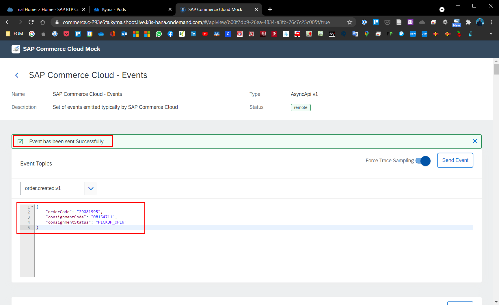
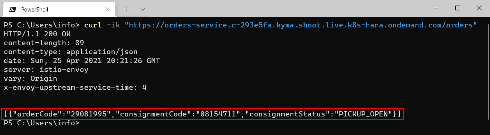

# Chapter 4.3.4: Testing of the Microservice

Within this part the implemented and exposed sap-commerce-mock will be tested, and the below steps will be performed.

* Test the Microservice by triggering an event from the SAP Commerce Mock
* Validating the event data stored in the Microservice / MS Azure Database

The validation is documented further below.

## Test the Microservice by triggering an event from the SAP Commerce Mock

To test if the configuration was done successfully, one of the pre-defined "SAP Commerce Cloud - Events" must be triggered. In the further case, is will be demonstrated by using the earlier used business case by triggering the Event "order.created.v1". To send an event from the SAP-Commerce-Mock to the Microservice "orders-service" perform the following steps.

1. Go to the "sap-commerce-mock" namespace and access the SAP-Commerce-Mock via the Host-URL under Discovery and Network -> API Rules. 

2. Switch to the "Remote API" tab and select "SAP Commerce Cloud - Events" which have been configured earlier.

3. From the Event Topic dropdown, select the "order.created.v1" event type. As you can see the following payload will be automatically proposed.

```
{
	"orderCode": "76272727"
}
```

4. To test also the further fields, we enhance the payload as followed shown and select Send Event to trigger the Event. A short message in the UI will confirm that the event was sent to the Microservice.

```
{
    "orderCode": "29081995",
    "consignmentCode": "08154711",
    "consignmentStatus": "PICKUP_OPEN"
}
```

5. The successful triggering of the event is shown below.




## Validating the event data stored in the Microservice

1. By calling the microservice with the following command, we can verify that the event details were saved.

```
curl -ik "https://orders-service.c-293e5fa.kyma.shoot.live.k8s-hana.ondemand.com/orders"
```

2. The sent events data is stored in the pods in-memory database as shown below.




## Sources

* Guide: [Kyma-Project: Getting Started, Version 1.21 (latest): Test the trigger](https://kyma-project.io/docs/1.20/root/getting-started#getting-started-trigger-the-microservice-with-an-event-test-the-trigger)


## Summary and next step

With this chapter the Microservice has been tested by triggering an order.create event. There for the question "How can a prototype of a microservice be implemented based on the Kyma Runtime to extend the SAP Commerce Cloud?" was tried to answer. Within the next part of the Bachelor-Thesis, the implemented Microservice-Prototype will be evaluated against the in chapter 3 elaborated success factors, by performing interviews with experts. 

[Go back to start](https://github.com/klouisbrother/ba-kyma-prototype)
