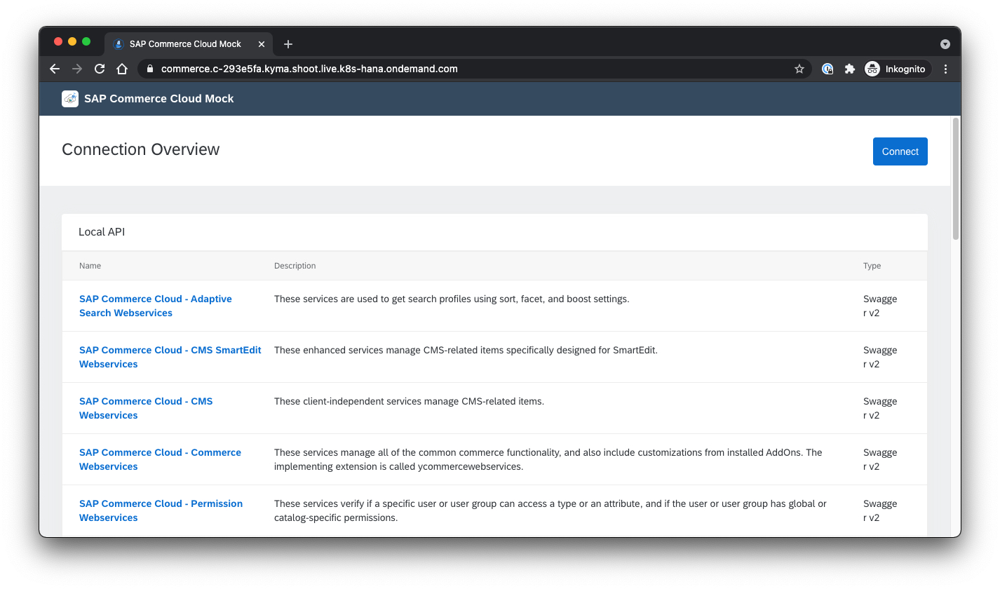

# Documentation of the Installation of the SAP Commerce mock 

To connect to this Microservice, the SAP Commerce Mock is used to Trigger Events, send and receive data to and from the Kyma-based Microservice. 

# Installation steps

1. Create sap-commerce-mock namespace in kyma

2. Deploy the commerce-mock application to the sap-commerce-mock namespace. Clone the repo or save the yaml file in the folder /commerce-mock/deployment of the xf-application-mocks project.

3. Go to the namespace and choose "deploy new resource". Apply first k8s.yaml and then the kyma.yaml.

4. After some minutes, the commerce-mock application is ready via the URL under Discovery and Network -> API Rules.

# Sources

- Guide: https://blogs.sap.com/2020/06/17/sap-cloud-platform-extension-factory-kyma-runtime-mock-applications/ 
- Original GitRepo: https://github.com/SAP-samples/xf-application-mocks/tree/master/commerce-mock
