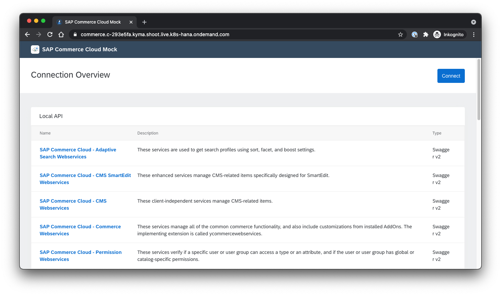

# Chapter 4.3.1 prerequisites

The following prerequisities are the starting point for the further implementation: 

* Access to Kyma Runtime
* SAP Commerce Mock as consuming system
* Development tools

The setup is explained and documented in the follow further.

## Access to Kyma Runtime

Kyma is used as Runtime on the SAP Business Technology Platform (Trialversion: https://www.sap.com/cmp/td/sap-cloud-platform-trial.html). Further the first configuration setups have to be done:

## Development tools

The following tools have to be available, installed and configured:

* kubectl needs to be installed locally
* .kube/config file needs to be configured and including the kubeconfig from the Kyma Runtime
* Code editor and commandline tool needs to be available, in this case Visual Studio Code was used

## SAP Commerce Mock as consuming system

To connect to the the to be implemented Microservice, the SAP Commerce Mock is used to Trigger Events, send and receive data to and from the Kyma-based Microservice.

### Installation via Command Line

1. Create new namespace:

```
kubectl create namespace sap-commerce-mock
```

2. Deploy the k8s.yaml into the new namespace
```
kubectl apply -f https://raw.githubusercontent.com/SAP/xf-application-mocks/master/commerce-mock/deployment/k8s.yaml -n sap-commerce-mock

```

3. Deploy the kyma.yaml into the new namespace
```
kubectl apply -f https://raw.githubusercontent.com/SAP/xf-application-mocks/master/commerce-mock/deployment/kyma.yaml -n sap-commerce-mock
```


### Alternative: Installation via GUI


## SAP Commerce 

To connect to this Microservice, the SAP Commerce Mock is used to Trigger Events, send and receive data to and from the Kyma-based Microservice. 

# Assumptions


# Installation steps

1. Create sap-commerce-mock namespace in kyma

2. Deploy the commerce-mock application to the sap-commerce-mock namespace. Clone the repo or save the yaml file in the folder /commerce-mock/deployment of the xf-application-mocks project.

3. Go to the namespace and choose "deploy new resource". Apply first k8s.yaml and then the kyma.yaml.

4. After some minutes, the commerce-mock application is ready via the URL under Discovery and Network -> API Rules.



# Sources

- Guide: https://blogs.sap.com/2020/06/17/sap-cloud-platform-extension-factory-kyma-runtime-mock-applications/ 
- Original GitRepo: https://github.com/SAP-samples/xf-application-mocks/tree/master/commerce-mock
