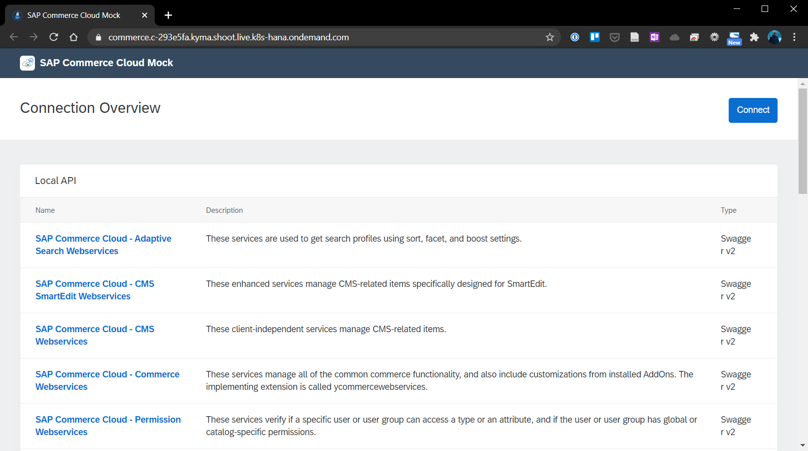

# Chapter 4.3.1: Prerequisites for implementation

The following prerequisities are the starting point for the further implementation: 

* Access to Kyma runtime
* Setup the development tools
* Deploy the SAP Commerce Mock as consuming system into a Kyma Namespace

The setup is explained and documented in the follow further.

## Access to Kyma runtime

Kyma is used as Runtime on the SAP Business Technology Platform ([Link to trialversion](https://www.sap.com/cmp/td/sap-cloud-platform-trial.html)). To access it the following registration and configuration steps have to be done:

1. Creation of S-User / SAP Account via SAP.com.

2. Login to the [SAP BTP Trial Account](https://www.sap.com/cmp/td/sap-cloud-platform-trial.html) with the newly created S-User.

3. Go to "Trial environment" and click on "Enable Kyma". Enter a name for the new Kyma environment. After some time, nearly 30 minutes, the Kyma environment is provisioned and available on the SAP Business Technology Platform.

4. To be able to access the Kyma environment with the in step 1 created S-User account, further access rights have to be granted as described under [Getting Started in the Kyma Environment](https://help.sap.com/viewer/65de2977205c403bbc107264b8eccf4b/Cloud/en-US/d1abd18556f24fb091d081b2e3454b8b.html).

5. As discribed two new roles "KymaRuntimeNamespaceAdmin" and "KymaRuntimeNamespaceDeveloper" have to be created under the role collection "Kyma_Admin_Role".

6. By accessing the SAP BTP "Trust Configuration", select "Default identity provider", enter the S-User account id and assign the role collect "Kyma_Admin_Role" to it.

7. Go back to the overview and access the Kyma Runtime under the trial account via Kyma Environment -> "Link to dashboard". 

## Setup the development tools

The following tools have to be available, installed and configured for further administration and development of the Kyma Runtime:

* kubectl needs to be installed on the local maschine
* ~.kube/config file needs to be configured on the local maschine so that it includes the Kubeconfig from the Kyma Runtime (Available under Account -> Get Kubeconfig in the Kyma Environment)
* Code editor and command-line tool needs to be available, in this case Visual Studio Code will be used

## Deploy the SAP Commerce Mock as consuming system into a Kyma Namespace

To simulate a consuming E-Commerce-System, especially a SAP Commerce Cloud System, a pre-configured Varkes-based [SAP-Commerce-Mock](https://blogs.sap.com/2020/06/17/sap-cloud-platform-extension-factory-kyma-runtime-mock-applications/ ) will be used to trigger Events, send and receive data to and from the Kyma-based Microservice.

### Installation via Command Line

1. Create a new namespace with the following command in Kyma, dedicated for the SAP-Commerce-Mock.

```
kubectl create namespace sap-commerce-mock
```

2. Perform the following command, to deploy the [k8s.yaml](https://raw.githubusercontent.com/SAP/xf-application-mocks/master/commerce-mock/deployment/k8s.yaml) from the Github Repository [SAP-samples/xf-application-mocks](https://github.com/SAP-samples/xf-application-mocks/tree/master/commerce-mock) into the new namespace.
```
kubectl apply -f https://raw.githubusercontent.com/SAP/xf-application-mocks/master/commerce-mock/deployment/k8s.yaml -n sap-commerce-mock

```

3. Perform the following command, to deploy the [kyma.yaml](https://raw.githubusercontent.com/SAP/xf-application-mocks/master/commerce-mock/deployment/kyma.yaml) from the Github Repository [SAP-samples/xf-application-mocks](https://github.com/SAP-samples/xf-application-mocks/tree/master/commerce-mock) into the new namespace.
```
kubectl apply -f https://raw.githubusercontent.com/SAP/xf-application-mocks/master/commerce-mock/deployment/kyma.yaml -n sap-commerce-mock
```

4. After some minutes, the sap-commerce-mock application is ready and can be accessed via the URL under Discovery and Network -> API Rules.




### Alternative: Installation via GUI

1. Create a new namespace via GUI with name "sap-commerce-mock", dedicated for the SAP-Commerce-Mock.

2. Clone or Copy the deployment files from the GitRepo [SAP-samples/xf-application-mocks](https://github.com/SAP-samples/xf-application-mocks/tree/master/commerce-mock) to you local machine.

3. Select the namespace, click on "Deploy new workload" and select the downloaded [k8s.yaml](https://raw.githubusercontent.com/SAP/xf-application-mocks/master/commerce-mock/deployment/k8s.yaml).

4. Again, click on "Deploy new workload" and select the downloaded [kyma.yaml](https://raw.githubusercontent.com/SAP/xf-application-mocks/master/commerce-mock/deployment/kyma.yaml).

5. After some minutes, the commerce-mock application is ready via the URL under Discovery and Network -> API Rules.

## Sources

- Guide: https://blogs.sap.com/2020/06/17/sap-cloud-platform-extension-factory-kyma-runtime-mock-applications/ 
- Original GitRepo: https://github.com/SAP-samples/xf-application-mocks/tree/master/commerce-mock
----- To be updated with further sources -----

## Summary and next step

With this chapter the SAP Commerce Mock as consuming system is available. As next step the pre-developed Microservice has to be deployed.

[Next - Chapter 4.3.2: Implementation of the functionality](https://github.com/klouisbrother/ba-kyma-prototype/blob/main/documentation/4.3.2_implementation.md) 