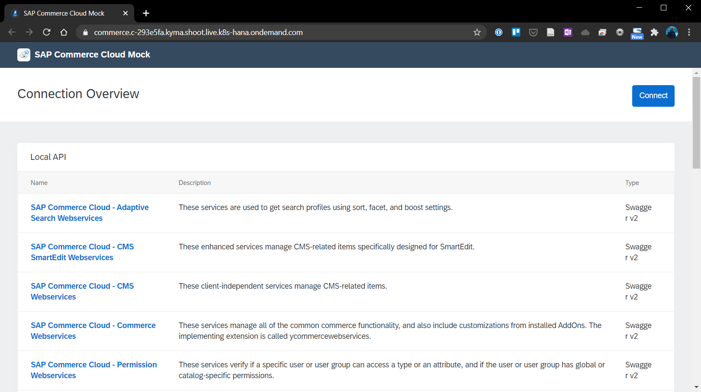

# Chapter 4.3.1: Prerequisites for implementation

The following prerequisities are the starting point for the further implementation: 

* Access to Kyma Runtime
* Development tools
* SAP Commerce Mock as consuming system

The setup is explained and documented in the follow further.

## Access to Kyma Runtime

Kyma is used as Runtime on the SAP Business Technology Platform (Trialversion: https://www.sap.com/cmp/td/sap-cloud-platform-trial.html). Further the first configuration setups have to be done:

1. Creation of S-User / SAP Account via SAP.com

2. Trial account created with new S-User account via https://www.sap.com/cmp/td/sap-cloud-platform-trial.html and validated

3. Go to trial environment and click on "Enable Kyma". Enter a name for the Kyma environment. After around 30min the Kyma Runtime is created on the SAP Business Technology Platform.

4. Add further access rights, to be able to access the Kyma environment with this S-User account. Further described here: https://help.sap.com/viewer/65de2977205c403bbc107264b8eccf4b/Cloud/en-US/d1abd18556f24fb091d081b2e3454b8b.html 

5. Created the two new roles "KymaRuntimeNamespaceAdmin" and "KymaRuntimeNamespaceDeveloper" as discribed under the role collection "Kyma_Admin_Role".

6. Access the Trust Configuration and select "Default identity provider", enter the S-User account and assign the role collect "Kyma_Admin_Role".

7. Go back to the overview and access the Kyma Runtime. 

## Development tools

The following tools have to be available, installed and configured:

* kubectl needs to be installed locally
* .kube/config file needs to be configured and including the kubeconfig from the Kyma Runtime
* Code editor and commandline tool needs to be available, in this case Visual Studio Code was used

## SAP Commerce Mock as consuming system

To connect to the the to be implemented Microservice, the SAP Commerce Mock is used to Trigger Events, send and receive data to and from the Kyma-based Microservice.

### Installation via Command Line

1. Create new namespace:

```
kubectl create namespace sap-commerce-mock
```

2. Deploy the k8s.yaml into the new namespace
```
kubectl apply -f https://raw.githubusercontent.com/SAP/xf-application-mocks/master/commerce-mock/deployment/k8s.yaml -n sap-commerce-mock

```

3. Deploy the kyma.yaml into the new namespace
```
kubectl apply -f https://raw.githubusercontent.com/SAP/xf-application-mocks/master/commerce-mock/deployment/kyma.yaml -n sap-commerce-mock
```
4. After some minutes, the commerce-mock application is ready via the URL under Discovery and Network -> API Rules.




### Alternative: Installation via GUI

1. Create a new namespace via GUI

2. Select the namespace and click on "Deploy new workload" and select the downloaded https://raw.githubusercontent.com/SAP/xf-application-mocks/master/commerce-mock/deployment/k8s.yaml 

3. Select the namespace and click on "Deploy new workload" and select the downloaded https://raw.githubusercontent.com/SAP/xf-application-mocks/master/commerce-mock/deployment/kyma.yaml

4. After some minutes, the commerce-mock application is ready via the URL under Discovery and Network -> API Rules.

## Sources

- Guide: https://blogs.sap.com/2020/06/17/sap-cloud-platform-extension-factory-kyma-runtime-mock-applications/ 
- Original GitRepo: https://github.com/SAP-samples/xf-application-mocks/tree/master/commerce-mock


## Next Step

[Next - Chapter 4.3.2: Implementation of the functionality](https://github.com/klouisbrother/ba-kyma-prototype/blob/main/documentation/4.3.2_implementation.md) 