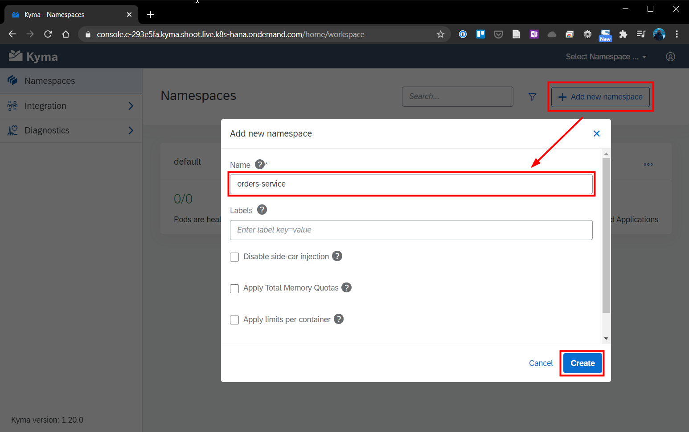
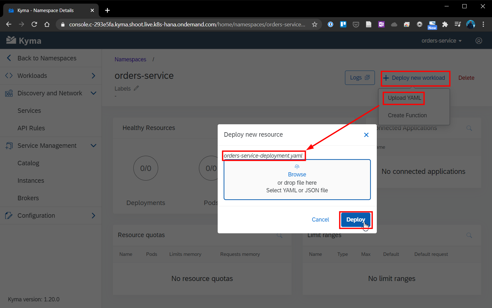
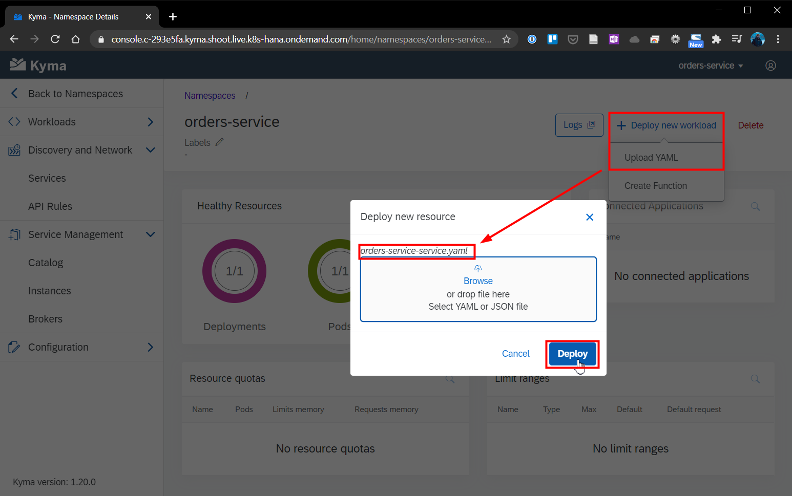
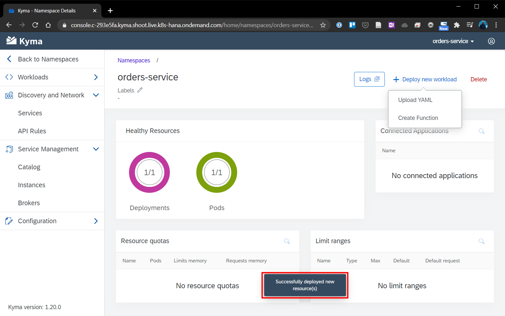

# Chapter 4.3.2: Implementation

Within this chapter the following steps will be performed and are described below:

* Creation of namespace for the microservice (this time via the Kyma GUI)
* Deployment of the pre-developed microservice image (this time via the Kyma GUI)


## 1. Create "order-service" namespace

1. Create namespace
```
kubectl create ns orders-service
```
2. Check that the Namespace was set up. This is indicated by the Namespace status phase Active:
```
kubectl get ns orders-service -o=jsonpath="{.status.phase}"
```



## 2. Create a microservice by deploying orders-service on the cluster in the created Namespace.

1. Apply the microservice definition to the orders-service Namespace on your cluster:
´´´
kubectl apply -f https://raw.githubusercontent.com/kyma-project/examples/master/orders-service/deployment/orders-service-deployment.yaml
´´´
2. Check that the Deployment was created. The correct Deployment status sets readyReplicas to 1:
´´´
kubectl get deployment orders-service -n orders-service -o=jsonpath="{.status.readyReplicas}"
´´´
3. Apply the Kubernetes Service to the orders-service Namespace on your cluster:
´´´
kubectl apply -f https://raw.githubusercontent.com/kyma-project/examples/master/orders-service/deployment/orders-service-service.yaml
´´´


-----------

## 3. Expose the microservice through the APIRule custom resource (CR) on HTTP endpoints. 


4. Add the Redis service as an addon.
5. Create the Redis service instance (ServiceInstance CR) in the Namespace so you can bind it with the microservice and Function.
6. Bind the microservice to the Redis service by creating ServiceBinding and ServiceBindingUsage CRs. 
7. Connect Commerce mock as the external application.
8. Trigger the microservice to react to the order.deliverysent.v1 event from Commerce mock. Send the event. Then, see if the microservice reacts to it and saves its details in the Redis database.

Sources:

* https://kyma-project.io/docs/root/getting-started/#getting-started-create-a-namespace 
* https://github.com/kyma-project/examples/tree/main/orders-service


--------------------------------


## Deployment of Microservice "order-service" as sample functionality

### Installation via GUI

1. Create a new namespace via GUI via name "orders-service". No further details have to be added.


2. Clone the Github Repository https://github.com/kyma-project/examples/tree/main/orders-service to you local machine. This Repository includes the needed deployment files ([orders-service-deployment.yaml](https://github.com/kyma-project/examples/blob/main/orders-service/deployment/orders-service-deployment.yaml) and [orders-service-service.yaml](https://github.com/kyma-project/examples/blob/main/orders-service/deployment/orders-service-service.yaml))

3. Select the namespace "orders-service", click on "Deploy new workload" and select the cloned / copied [orders-service-deployment.yaml](https://github.com/kyma-project/examples/blob/main/orders-service/deployment/orders-service-deployment.yaml)



4. Again, click on "Deploy new workload" and select the cloned / copied [orders-service-service.yaml](https://github.com/kyma-project/examples/blob/main/orders-service/deployment/orders-service-service.yaml)



5. After a short time, the in the deployment is successfully and the in the deployment files described ressources are started and running




### Alternative: Installation via Command Line

As also shown in [Chapter 4.3.1: Prerequisites for implementation](https://github.com/klouisbrother/ba-kyma-prototype/blob/main/documentation/4.3.1_prerequisites.md), the creation of the namespace and deployment of the .yaml-files could also be done via command line.

## Sources

* Guide and Original Github Repo: https://github.com/kyma-project/examples/tree/main/orders-service
* https://blogs.sap.com/2020/06/17/sap-cloud-platform-extension-factory-kyma-runtime-mock-applications/


## Summary and next step

With this chapter the pre-developed Microservice is available and running. As next step the connection between the consuming system SAP Commerce Mock and this Microserivce has to be done.

[Next - Chapter 4.3.3: Connection to SAP Commerce Mock](https://github.com/klouisbrother/ba-kyma-prototype/blob/main/documentation/4.3.3_connection.md) 