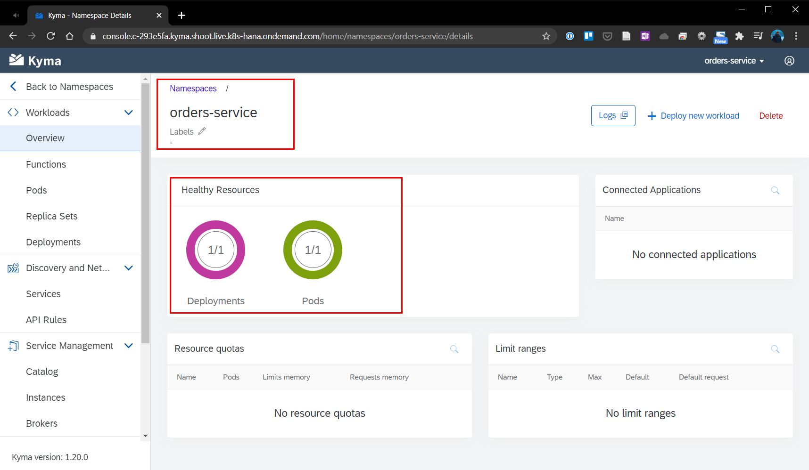

# Chapter 4.3.2: Implementation

Within this chapter the following steps will be performed and are described below:

* Create new "orders-service" namespace and deploy the "orders-service" Microservices
*


## Create new "orders-service" namespace and deploy the "orders-service" Microservices

1. Create a new namespace "orders-service" via command line.
```
kubectl create ns orders-service
```

2. Check that the Namespace was set up. This is indicated by the Namespace status phase Active.
```
kubectl get ns orders-service -o=jsonpath="{.status.phase}"
```


3. Create a Deployment that provides the microservice definition and enables you to run it on the cluster. The Deployment uses the eu.gcr.io/kyma-project/pr/orders-service:PR-162 image. This Docker image exposes the 8080 port on which the related Service is listening.
```
kubectl apply -f https://raw.githubusercontent.com/kyma-project/examples/master/orders-service/deployment/orders-service-deployment.yaml
```

4. Check if the ressources definied in the deployment file have been created. Deployment status will be readyReplicas "1".
```
kubectl get deployment orders-service -n orders-service -o=jsonpath="{.status.readyReplicas}"
```

5. Deploy the Kubernetes Service in the orders-service Namespace to allow other Kubernetes resources to communicate with your microservice.
```
kubectl apply -f https://raw.githubusercontent.com/kyma-project/examples/master/orders-service/deployment/orders-service-service.yaml
```


These steps could be also performed via the Kyma Environment User Interface. The UI is reflecting the in the deployment files defined ressources as shown below.




## Expose the microservice to other ressources outsite of the cluster

Until now a standalone microservice was deployed, now we have to allow to make is available to other ressources outsite of the cluster via an API Rule, this time via the Kyma UI.

1. Select the namespace "orders-service" and go to "Discovery and Network" -> API Rules and create a new API Rule. 

2. Enter a specific name and hostname for the API rule. In this case "orders-service" can used as well. As Service "orders-service (port: 80) shoud be selected, to indicate the Service name for which you want to create the API Rule.

3. As access stratgy select as handler "noop" and allow only GET and POST methods check. This allows to send the orders to the Service and retrieve orders from it without any token. The configuration is shown below. Click on create, to create and save the rule.


4. The API rule status will be "OK" and you can access the Service by by selecting the HTTPS link under Host and adding the /orders endpoint at the end of it. For this case: https://orders-service.c-293e5fa.kyma.shoot.live.k8s-hana.ondemand.com/orders


5. To quickly test the availability of the microservice from external perform a POST request to the Microservice using the URL: https://orders-service.c-293e5fa.kyma.shoot.live.k8s-hana.ondemand.com/orders and a sample orders similar as seen below.


```
{
    "orderCode": "762727210",
    "consignmentCode": "76272725",
    "consignmentStatus": "PICKUP_COMPLETE"
}
```

6. By further performing the following command, you will get back the processed order data as seen below. By now the microservice uses in-memory storage, which means every time you delete the Pod of the microservice or change the Deployment definition, you lose the order details.

```
curl -ik https://orders-service.c-293e5fa.kyma.shoot.live.k8s-hana.ondemand.com/orders
```


## Connect Commerce-Mock as external application 

Let's now connect an external application to the Microservice. As monolithic application the SAP Commerce Mock, which was configured earlier, will be used. Also this part will be done via the Kyma UI.

1. In the Kyma UI, access the Integration -> Applications/System and select the SAP Commerce Mock which was made available earlier. In this case it is called "mp-sap-commerce-mock".

2. A Binding between the application and the "orders-service" namespace has to be created, to be able to provide the APIs later on. Herefor click on "Create Binding", select the "orders-service" namespace and click on create.

3. Navigate to the "orders-service" namespace an navigate to Service Management -> Catalog. On the "Services" tab, click on the new service "mp-sap-commerce-mock". 

4. Click on "Add", enter a name for e.g. "sap-commerce-mock" and select the API by clicking on it, in this case "SAP Commerce Cloud - Events". Confirm the entries by clicking confirm. With these steps the events have been enabled in the "orders-service" namespace. The activated events API will have after a short time the status "Running" under Service Management -> Instances, as seen below.


## Create the event trigger

As an example, in this case the Event order.created will be added. 

1. Go to the namespace "orders-service" -> Discovery and Network -> Services. Than select the service "orders-service". 

2. In the service detail view click on "Create Event Subscription".

3. Search for the "order.created.v1" which is made available by the commerce-mock application and click on save. The Event Trigger will be added to the Service as shown below.


With this step the setup and configuration is ready for the first test.


## Test the microservice by triggering an event from the Commerce-Mock

To test if the configuration was done successfully, one of the pre-defined "SAP Commerce Cloud - Events" has to be triggered. In the further case, is will be demonstrated by using the earlier used busines case by triggering the Event "order.created.v1".


-----------
-- Hier gehts weiter mit  https://kyma-project.io/docs/1.20/root/getting-started#getting-started-trigger-the-microservice-with-an-event-test-the-trigger


1. 


Trigger the microservice to react to the order.deliverysent.v1 event from Commerce mock. Send the event. Then, see if the microservice reacts to it and saves its details in the Redis database.


-------------------------


## Enhancement with DB

This section should demonstrate the Kyma Service Catalog.

4. Add the Redis service as an addon.
5. Create the Redis service instance (ServiceInstance CR) in the Namespace so you can bind it with the microservice and Function.
6. Bind the microservice to the Redis service by creating ServiceBinding and ServiceBindingUsage CRs. 
7. Connect Commerce mock as the external application.
8. 

Sources:

* https://kyma-project.io/docs/root/getting-started/#getting-started-create-a-namespace 
* https://github.com/kyma-project/examples/tree/main/orders-service


--------------------------------


## Deployment of Microservice "order-service" as sample functionality

### Installation via GUI

1. Create a new namespace via GUI via name "orders-service". No further details have to be added.


2. Clone the Github Repository https://github.com/kyma-project/examples/tree/main/orders-service to you local machine. This Repository includes the needed deployment files ([orders-service-deployment.yaml](https://github.com/kyma-project/examples/blob/main/orders-service/deployment/orders-service-deployment.yaml) and [orders-service-service.yaml](https://github.com/kyma-project/examples/blob/main/orders-service/deployment/orders-service-service.yaml))

3. Select the namespace "orders-service", click on "Deploy new workload" and select the cloned / copied [orders-service-deployment.yaml](https://github.com/kyma-project/examples/blob/main/orders-service/deployment/orders-service-deployment.yaml)


4. Again, click on "Deploy new workload" and select the cloned / copied [orders-service-service.yaml](https://github.com/kyma-project/examples/blob/main/orders-service/deployment/orders-service-service.yaml)


5. After a short time, the in the deployment is successfully and the in the deployment files described ressources are started and running


### Alternative: Installation via Command Line

As also shown in [Chapter 4.3.1: Prerequisites for implementation](https://github.com/klouisbrother/ba-kyma-prototype/blob/main/documentation/4.3.1_prerequisites.md), the creation of the namespace and deployment of the .yaml-files could also be done via command line.

## Sources

* Guide and Original Github Repo: https://github.com/kyma-project/examples/tree/main/orders-service
* https://blogs.sap.com/2020/06/17/sap-cloud-platform-extension-factory-kyma-runtime-mock-applications/


## Summary and next step

With this chapter the pre-developed Microservice is available and running. As next step the connection between the consuming system SAP Commerce Mock and this Microserivce has to be done.

[Next - Chapter 4.3.3: Connection to SAP Commerce Mock](https://github.com/klouisbrother/ba-kyma-prototype/blob/main/documentation/4.3.3_connection.md) 