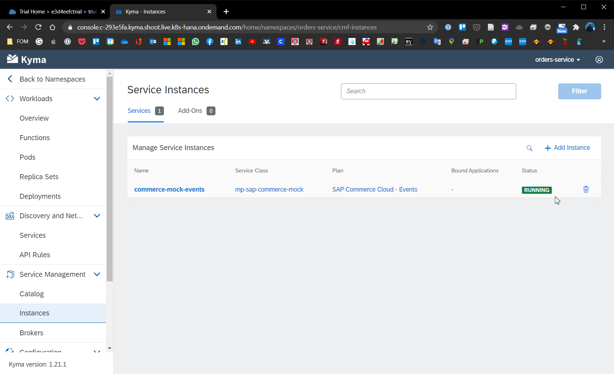
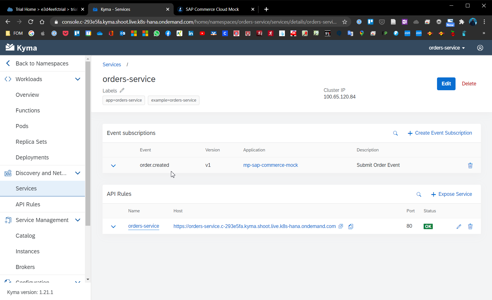

# Chapter 4.3.3: Connection to SAP Commerce Mock

Within this chapter the following steps will be performed and are described below:

* Connect Commerce-Mock as external application
* Create the event trigger

## Connect Commerce-Mock as external application 

Let's now connect an external application to the Microservice. As monolithic application the SAP Commerce Mock, which was configured earlier, will be used. Also this part will be done via the Kyma UI.

1. In the Kyma UI, access the Integration -> Applications/System and select the SAP Commerce Mock which was made available earlier. In this case it is called "mp-sap-commerce-mock".

2. A Binding between the application and the "orders-service" namespace has to be created, to be able to provide the APIs later on. Herefor click on "Create Binding", select the "orders-service" namespace and click on create.

3. Navigate to the "orders-service" namespace an navigate to Service Management -> Catalog. On the "Services" tab, click on the new service "mp-sap-commerce-mock". 

4. Click on "Add", enter a name for e.g. "sap-commerce-mock" and select the API by clicking on it, in this case "SAP Commerce Cloud - Events". Confirm the entries by clicking confirm. With these steps the events have been enabled in the "orders-service" namespace. The activated events API will have after a short time the status "Running" under Service Management -> Instances, as seen below.

## Create the event trigger

As an example, in this case the Event order.created will be added. 

1. Go to the namespace "orders-service" -> Discovery and Network -> Services. Than select the service "orders-service". 

2. In the service detail view click on "Create Event Subscription".

3. Search for the "order.created.v1" which is made available by the commerce-mock application and click on save. The Event Trigger will be added to the Service as shown below.

With this step the setup and configuration is ready for the first test.

## Sources

* Guides: 
    * https://blogs.sap.com/2020/06/17/sap-cloud-platform-extension-factory-kyma-runtime-commerce-mock-events-and-apis/
    * https://blogs.sap.com/2020/06/17/sap-cloud-platform-extension-factory-kyma-runtime-mock-applications/
    * https://blogs.sap.com/2019/06/19/sap-c4hana-extensibility-commerce-mock-setup/ 

Good source: https://kyma-project.io/docs/root/getting-started/

## Summary and next step

With this chapter the SAP Commerce Mock and the Microservice have been registered, connected and the events trigger got configured. As next step the connection and functionality has to be tested.

[Next - Chapter 4.3.4: Testing of the functionality](https://github.com/klouisbrother/ba-kyma-prototype/blob/main/documentation/4.3.4_testing.md) 