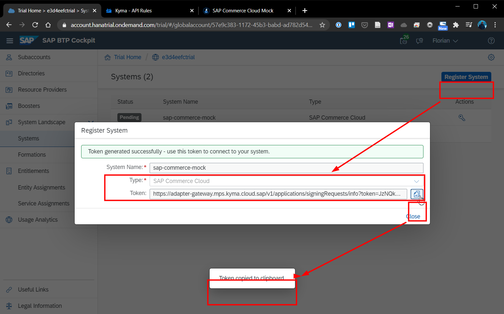

# Chapter 4.3.3: Connection to SAP Commerce Mock

Within this chapter the following steps will be performed and are described below:

* Registration of the SAP Commerce Mock as a System in the SAP BTP Cockpit (Token) and Perform the Handshake (via Token) to connect the SAP Commerce Mock System with SAP BTP / Kyma, Register the provided APIs / Events
* Create a Formation, to assign different SAP systems of the different SAP solutions that you want to extend in the context of the same business case
* Register the provided APIs / Events

and Setup of the connectionn between the SAP Commerce Mock and orders-service Microservice
*

## Registration of the SAP Commerce Mock as a System in the SAP BTP Cockpit (Token) and Perform the Handshake (via Token) to connect the SAP Commerce Mock System with SAP BTP / Kyma, Register the provided APIs / Events

1. Go to the SAP BTP Cockpit -> System Landscape -> Systems. Click on "Register System". Enter as shown below a specific name for the System and select the type of system. Click on "Register".

2. Now a token for the new system has be created. Copy this into the clipboard as shown below and close the window. You will see that the new system is in status "Pending". (Note: In the screenshot below an already used instance of the named "commerce-mock" is shown, as SAP is currently not supporting the deletion of systems in the trial version: [Support case: Cannot remove registered systems from Systems page](https://ga.support.sap.com/dtp/viewer/#/tree/2065/actions/26547:28984:39747))

3. To get the SAP-Commerce-Mock system as consuming system, connected to SAP BTP / Kyma the token has to be copied into the Connection field in the SAP Commerce Mock, to perform the first handshake. To do so, open the SAP Commerce Mock System and click on "Connect". Paste the Token in and click on "Connect". 

4. After successful exchange, the system status in the SAP Commerce Mock and in the SAP BTP will change to "Registered". So to say, the Systems do now know each other.

5. As the SAP-commerce-mock is already providing several APIs and Events, we are now going to register all of them with the Kyma Environment. For this click on "Register All" in the SAP-Commerce-Mock Application. After a short time all APIs are registered as shown below.

Source: https://help.sap.com/viewer/65de2977205c403bbc107264b8eccf4b/Cloud/en-US/2ffdaff0f1454acdb046876045321c91.html
https://blogs.sap.com/2019/06/19/sap-c4hana-extensibility-commerce-mock-setup/

## Create a Formation, to assign different SAP systems of the different SAP solutions that you want to extend in the context of the same business case

1. Go to the SAP BTP Cockpit -> System Landscape -> Formations. Click on "Create Formation". Enter as shown below a specific name for the formation, select the subaccount and the system. Click on "Create" and the formation is created.

2. The setup can be verifyed by checking the Kyma the new connected system in Kyma under Integration -> Application/Systems as shown below

Source: https://help.sap.com/viewer/65de2977205c403bbc107264b8eccf4b/Cloud/en-US/68b04fa73aa740cb96ed380a85a4761a.html 
https://blogs.sap.com/2019/06/19/sap-c4hana-extensibility-commerce-mock-setup/

## Triggering the Microservice "orders-service" with an SAP-Commerce-Mock Event

1. Bind the "orders-service" namespace to the "mp-sap-commerce-mock" application, as seen below. The binding is also reflected in the specific namespace, as one bound application.

2. The newly bound application is providing under the specific namespace "orders-service" -> Service Management -> Catalog -> Tab Services a new Service "mp-sap-commerce-mock". Select it.

3. Select the "mp-sap-commerce-mock" and click on "SAP Commerce Cloud - Events". Click on "Add" to add service instance, which will allows to utilize the events within the "orders-service" namespace. The selection is shown below.

4. 

Bind the Services and Events to the Namespace orders-service

All or some can be made available
- Bind one event to the orders service
- Additional Service in the Service Catalog

Source: https://blogs.sap.com/2019/07/16/sap-c4hana-extensibility-triggering-microservices-with-events/ 

## Sources

* Guides: 
    * https://blogs.sap.com/2020/06/17/sap-cloud-platform-extension-factory-kyma-runtime-commerce-mock-events-and-apis/
    * https://blogs.sap.com/2020/06/17/sap-cloud-platform-extension-factory-kyma-runtime-mock-applications/
    * https://blogs.sap.com/2019/06/19/sap-c4hana-extensibility-commerce-mock-setup/ 

## Summary and next step

With this chapter the SAP Commerce Mock and the Microservice have been registered, connected and the events trigger got configured. As next step the connection and functionality has to be tested.

[Next - Chapter 4.3.4: Testing of the functionality](https://github.com/klouisbrother/ba-kyma-prototype/blob/main/documentation/4.3.4_testing.md) 